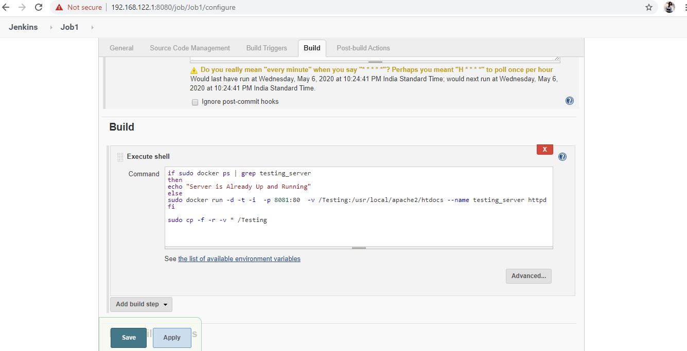
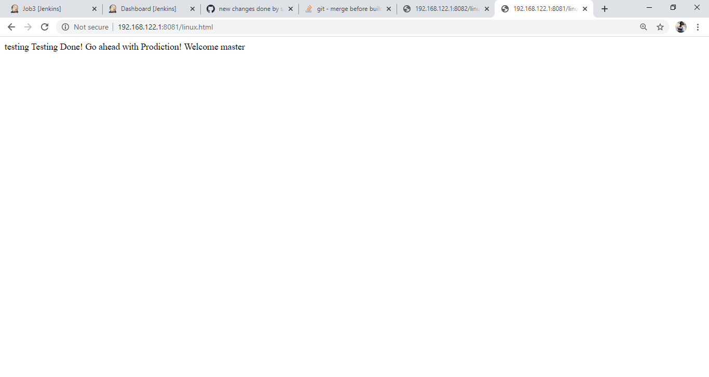

# This Project is to build a testing and deployment pipeline to automatically deploy a webserver and deploy modified contents once a git commit is made
***Pre-Requisites*** : 
RHEL 8, Docker, Jenkins and Git Bash. Make Sure you have jenkins and docker installed on rhel8 and Git bash installed on windows and also in jenkins make sure that you have github plugin installed.

***Configuration***:                                                                                                                    
i) First disable the firewall in rhel8 using ```systemctl stop firewalld``` and also run ```setenforce 0```  c                           
ii) Now Start Docker and jenkins using the command ```systemctl start docker``` and ```systemctl start jenkins```                      
iii) Now open jenkins in your windows using your local Ip address                                                                     
iv) Also start Git bash and configure git remote in it                                                                        
v) To do automatic push once commit is made in git remote then go to .git/hooks directory and create a post-commit.sample file and inside it write                                                                                                                        
```#!/bin/bash/   git push```

***Jenkins Build***                                                                                                                         
***Job1: Testing Server Deployment***                                                                                                     
To monitor the testing branch of our github Repository Continuously and if any commit is made then our job1 will deploy a docker container which will create a webserver and this job will automatically fetch the modified contents of the repository and will update them in the webserver automatically. The configuration is done as below.




***Job2 : Production Server Deployment***                                                                                                 
To monitor the master branch of our github Repository Continuously and if any commit is made then our job2 will deploy a docker container which will create a webserver and this job will automatically fetch the modified contents of the repository and will update them in the webserver automatically. The configuration is done as below.


***Job3 : Merge and Deploy***                                                                                                         

This job will build only if the job1 that is if the tester confirms the code and commit it then this job will automatically run and it will merge the modified content of the code and the changes will be updated in the production server. The Configuratio is done as below.


***Working***:                                                                                                                          
Now our automatic webserver deployment is ready and lets check it.                                                                      
Open Git bash and edit a file using cat command and then commit it.                                                                   
Now you can see once it is committed job2 will run automatically and a web server will be deployed you can check it using the local ip and port of the server.


Now Comes the fun part the production server is ready and running now the tester comes and checks the code if any changes he will do it and once he committs, that is the confirmation signal then our job1 will run which will deploy the testing server and after that job3 will run and it will merge the testing code with the deployment code in the repository and then the modified contents will be uploaded in both test and deploy servers.





***Note: Tunneling can be done by ngrok to make our private IP public so that anyone can access it for now it can be done manually using the command ngrok http 8080 but it cant be add to the build because it will keep the build running forever until the build is aborted so to avoid it we have ommitted that part. Future enhancements will be made to overcome this***

